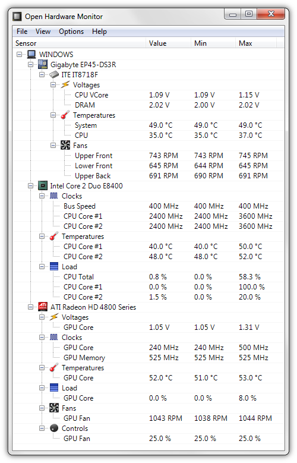

# INT301: Open Source Technologies
<h1><b>Question</b>Using any Open Source Software shows detailed information on various components. Results can be shared via the web and exported to a file.</h1>
___
<h3>What needs to be done! | Objective </h3>

This project topic demands me to explore an open-source software that can display detailed information about various components of a system. The software should be capable of sharing the results via the web and exporting them to a file. I have chosen <b>Open Hardware Monitor </b>software for this purpose. I need to demonstrate how this software can provide detailed information about hardware components such as CPU, GPU, RAM, motherboard, etc. and how this information can be shared and exported for analysis.

___
<h3>Scope of the project.</h3>

Explore open source software that can display detailed information about system components
Choose Open Hardware Monitor software for the project
Demonstrate how Open Hardware Monitor software can provide detailed information about hardware components such as CPU, GPU, RAM, motherboard, etc.
Show how the software can share results via the web
Explain how the software can export results to a file for analysis.

____
<h3>Brief Description</h3>

The INT301 project titled "Open Source Technologies" focuses on exploring open-source software that can display detailed information about various components of a system. The project objective is to demonstrate how this software can provide detailed information about hardware components such as CPU, GPU, RAM, motherboard, etc. and how this information can be shared and exported for analysis. The software chosen for this project is the Open Hardware Monitor, which has the capability to share results via the web and export them to a file. The project scope includes exploring the software, demonstrating its features and capabilities, and explaining how it can be used for analyzing hardware components. The project also aims to highlight the advantages of using open-source software for system monitoring and analysis. Overall, the project provides an opportunity to learn about open-source technologies and their applications in system monitoring and analysis.

____
<h3>System Description</h3>
The project aims to explore an open-source software that can display detailed information about various components of a system. Open Hardware Monitor software is chosen for this purpose. The software should be capable of sharing the results via the web and exporting them to a file. The project intends to demonstrate how Open Hardware Monitor software can provide detailed information about hardware components such as CPU, GPU, RAM, motherboard, etc., and how this information can be shared and exported for analysis.

<h4>Target system description</h4>
The target system is any computer system with compatible hardware components that can be monitored by the Open Hardware Monitor software. The software is compatible with Windows operating system versions starting from Windows XP to the latest version of Windows 10. The target system should have internet connectivity to share the results via the web.

<h4>Assumptions and Dependencies</h4>
The project assumes that the Open Hardware Monitor software will work as intended and provide accurate information about the system components. The project assumes that the target system has compatible hardware components that can be monitored by the software. The project depends on the availability of internet connectivity to share the results via the web.

 <h4>Functional/Non-Functional Dependencies</h4>
The project does not have any significant functional or non-functional dependencies.

<h4>Data set used in support of your project</h4>

The project does not use any specific data set. However, the Open Hardware Monitor software provides real-time data about the hardware components, which can be used for analysis and monitoring.
